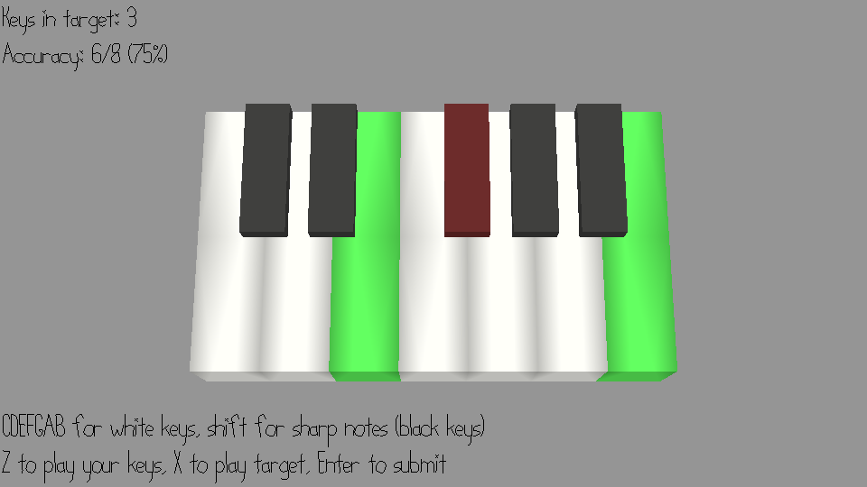

# Chord Identifier

Author: Yoseph Mak

Design: This is an ear training game with multiple notes. A given chord is played and you have to select notes on the keyboard to match the chord.

Screen Shot:

How To Play:

The CDEFGAB keys correspond to the white keys on the piano in the arrangement given. Hold shift for the black keys corresponding to C#, D#, F#, G#, or A#, respectively. For example, select C# with Shift+C.

When you press a series of keys, you can press Z to see how it sounds, or X to see how the target chord sounds. The number of keys in the current chord is shown in the top left.

Press enter to confirm your selection, after which you will be told which keys were right and which are wrong. Keep trying until you get the right chord!

Once you get a chord right, you'll be given a new chord, and the process repeats.

The main strategy here is practice, though knowing some of the correct keys after each guess helps.

This game was built with [NEST](NEST.md).
